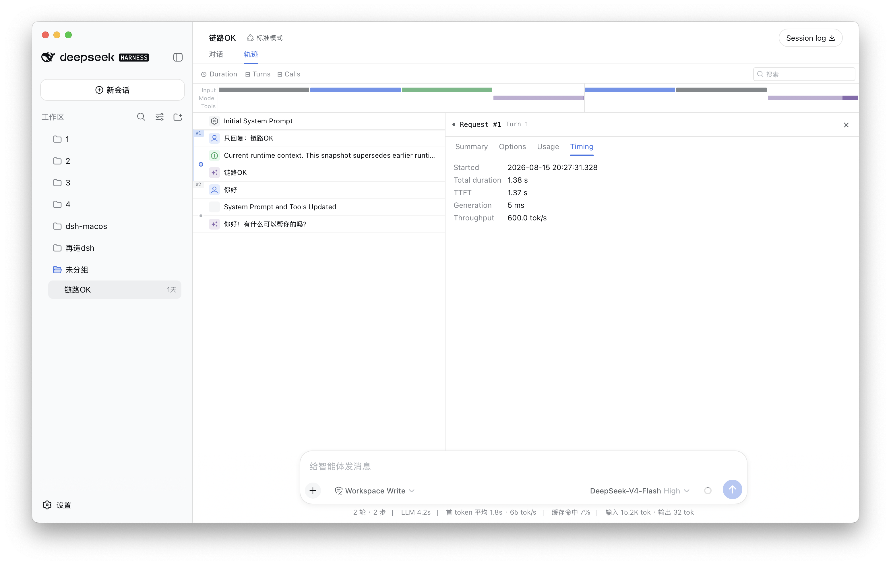
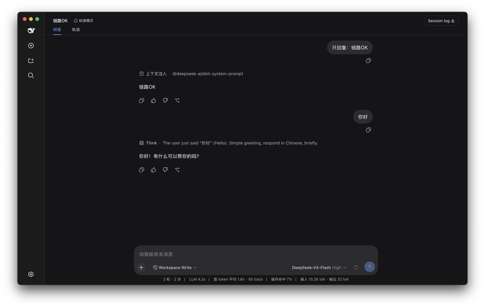

# DSH Desktop

> DeepSeek Harness（`dsh`）的 macOS 极致轻量桌面外壳

## 前言

这是一个独立的社区开源项目，**并非 DeepSeek 官方出品**，与 DeepSeek 及其关联方无任何隶属、合作或背书关系。它把官方的 dsh Web 界面装进一个约 850 KB 的原生 macOS 窗口里，并代为管理后端服务器进程——不重写官方界面的任何一部分，因此官方的功能演进与 Cordis 插件生态在这里 100% 可用。

## 目录

| 章节 | 内容 |
|---|---|
| [一键安装](#一键安装) | 三段式部署：环境预检 → 安装 → 状态回馈 |
| [桌面效果](#桌面效果) | 浅色 / 深色模式实拍 |
| [它是什么](#它是什么) | 功能清单与定位 |
| [它是如何工作的](#它是如何工作的) | 四层架构与设计决策速览 |
| [安全与风险](#安全与风险) | 公网暴露警示 · 稳定化签名的边界 |
| [注意事项](#注意事项) | 使用前提与已知边界 |
| [免责声明](#免责声明) | 法律与担保条款 |
| [查看更多](#查看更多) | 完整文档（Wiki 单页版）章节导航 |
| [友情链接](#友情链接) | 官方上游仓库 |
| [许可证](#许可证) | 开源协议 |

## 一键安装

打开终端，复制粘贴这一条命令：

```bash
curl -fsSL https://raw.githubusercontent.com/Farverge/DSH-MacOS/main/install.sh | bash
```

也可以**复制这段命令发给你正在使用的 AI agent**，它会自动完成安装部署并处理过程中的所有提示。

脚本执行的三段式流程：

1. **环境预检**——macOS 版本、架构、Node.js、必备工具、既有安装、端口占用状况逐项检查并给出 ✓/! 标记
2. **下载安装**——从 Releases 拉取最新版，温和退出运行中的旧实例后替换升级
3. **状态回馈**——自动启动应用，探测后端就绪状态，末尾输出 `KEY=VALUE` 摘要行（供 agent 直接解析）

另有**只读体检模式**，随时给本机做一套应用体检（报告同样可发给 agent 自动处理）：

```bash
curl -fsSL https://raw.githubusercontent.com/Farverge/DSH-MacOS/main/install.sh | bash -s -- doctor
```

体检覆盖：系统版本、应用安装与签名、Node.js、3080 端口身份与健康、桥接接口、npx 缓存副本数、失效解析缓存。追加 `--fix` 可执行白名单内的安全修复（如清理失效缓存）。

## 桌面效果

浅色模式：



深色模式：



## 它是什么

- **内嵌官方 Web GUI**：WKWebView 加载本地 dsh 服务，沉浸式窗口跟随系统深浅色；站外链接自动交给系统默认浏览器打开，壳内只保留官方界面
- **后端进程全托管**：启动时以「HTTP 200 + 官方标记」双重身份探测已有实例并直接接管（绝不双开后端），六级命令解析链摆脱 PATH 依赖，健康轮询 + 断连横幅自动重试且不丢页面状态
- **会话导出**：自动保存到「下载」文件夹并弹系统通知、定位文件
- **桌面布局 overlay**：红绿灯锚定的沉浸式标题栏、折叠侧栏居中适配——纯 CSS 实现，跟随官方界面更新
- **DSH 后端更新**：设置里一键检查，镜像源加速下载、完整性校验、自动清理旧缓存（跳过使用中的目录）并重启
- **桥接插件**：向系统注入服务器状态接口（pid / 版本 / 运行时长），并为插件生态预留原生通知通道
- **可选菜单栏插件 DSH Launcher**：独立小应用，鲸鱼常驻菜单栏一键唤起

## 它是如何工作的

四层薄壳架构，每一层都只做最少的事：

```text
UI 层      SwiftUI/AppKit —— 状态面板 ⇄ WebView 切换、原生菜单、设置
Web 层     WKWebView 内嵌官方 GUI + 纯 CSS 布局 overlay
进程层     ServerManager —— 身份探测/唯一性保证/解析链/轮询/更新链
桥接层     dsh-desktop-bridge 插件（status / notify 路由）
```

核心思路：**官方 UI 是 Cordis 插件集，装进 WebView 就能自动获得全部桌面能力**。外壳只负责三件事——把网页装进原生窗口（含导出拦截、通知、断连保护）、替用户管好 node 后端的生命周期、用纯 CSS 把官方界面的几何对齐到 macOS 窗口规范（红绿灯锚定、侧栏居中）。完整分层说明与设计决策见 Wiki。

## 安全与风险

dsh 的 Web 控制平面**没有内置认证层**（无 token / cookie / TLS）。上游仓库安全讨论 [#853](https://github.com/deepseek-ai/deepseek-harness/discussions/853) 指出：其唯一的 Host/Origin 栅栏被源码自述为"不是认证层"，若把服务端口暴露到回环地址之外（端口转发、隧道、绑定 0.0.0.0 等），存在未经身份验证的代码执行风险——默认回环部署定级 High，非回环部署定级 Critical。奇安信等安全厂商有公开报道。

> [!WARNING]
> 请勿将 3080 端口以任何形式暴露到回环地址之外：不做路由器端口映射，不使用 frp/ngrok 等隧道转发，不绑定 0.0.0.0。确需远程访问，必须自行叠加带认证的反向代理与 TLS，并自担全部风险。
>
> 本应用已将上述风险在架构层面收敛：后端固定绑定 127.0.0.1 回环地址，且不提供任何改绑公网接口的选项——公网暴露面在本项目中不存在。

关于本应用的分发签名，采用「稳定化 ad-hoc」方案（显式声明基于标识符的 Designated Requirement），其收益与需要知晓的风险如下：

> [!IMPORTANT]
> - **收益**：辅助功能等系统授权跨构建、跨版本持续有效，升级不再导致权限失效
> - **放宽的身份校验**：授权规则从"精确到字节的哈希"放宽为"精确到 bundle 标识符"——理论上，一个声称相同标识符的被篡改二进制也能通过该规则校验。自用及信任链可控的场景下可接受，但请始终从本仓库 Releases 获取安装包
> - **不构成分发信任**：该方案不等同于 Developer ID 公证。他人通过浏览器直接下载仍会被 Gatekeeper 拦截（推荐使用上方一键安装命令规避）
> - **一次性迁移**：若曾用旧版 ad-hoc 签名并授予过系统权限，需执行一次 `tccutil reset Accessibility com.deepseek-ai.dsh-desktop` 并重新勾选，此后永久稳定

> [!TIP]
> 保持后端为最新版本是最重要的安全习惯：设置 → 关于 → 检查 DSH 更新。与任何本地回环服务一样，本机其他程序理论上可以访问 3080 端口，请维持常规的 macOS 安全习惯。

## 注意事项

- 需要 **macOS 13+** 与 **Node.js**；端口固定使用 3080
- 关闭窗口 ≠ 退出（Dock 常驻），彻底退出用 Cmd+Q；默认退出时会带走由应用启动的后端
- 本项目按"现状"提供，更新后端依赖第三方镜像源与网络环境，请遵守所在地区法规及上游服务协议

## 免责声明

本项目是独立的社区开源项目，**并非 DeepSeek 官方出品**，与 DeepSeek 及其关联方不存在任何隶属、合作或背书关系。"DeepSeek""DeepSeek Harness"及相关名称、标识的权利归其权利人所有，本项目仅在指代意义上使用。

本软件按"现状"（AS IS）提供，不含任何明示或默示的担保。使用者需自行承担因安装、使用本软件所产生的全部风险与责任，包括但不限于数据丢失、服务中断或第三方平台条款问题。如本项目有任何侵权或不当之处，请联系仓库维护者，我们将及时处理。

## 查看更多

除本 README 外的全部文档（架构、构建、使用、更新、安全、体检、FAQ、版本历史）已集中收录于 Wiki 单页，按章节直达：

| 章节 | 直达链接 |
|---|---|
| 一键安装（三段式详解） | [Wiki · 一键安装](https://github.com/Farverge/DSH-MacOS/wiki#一键安装) |
| 使用指南 | [Wiki · 使用指南](https://github.com/Farverge/DSH-MacOS/wiki#使用指南) |
| 架构 | [Wiki · 架构](https://github.com/Farverge/DSH-MacOS/wiki#架构) |
| 构建与发版 | [Wiki · 构建与发版](https://github.com/Farverge/DSH-MacOS/wiki#构建与发版) |
| 更新机制 | [Wiki · 更新机制](https://github.com/Farverge/DSH-MacOS/wiki#更新机制) |
| 安全与风险 | [Wiki · 安全与风险](https://github.com/Farverge/DSH-MacOS/wiki#安全与风险) |
| 体检命令 Doctor | [Wiki · 体检命令](https://github.com/Farverge/DSH-MacOS/wiki#体检命令-doctor) |
| 常见问题 FAQ | [Wiki · FAQ](https://github.com/Farverge/DSH-MacOS/wiki#常见问题-faq) |
| 版本历史 Changelog | [Wiki · 版本历史](https://github.com/Farverge/DSH-MacOS/wiki#版本历史-changelog) |

## 友情链接

- DeepSeek Harness（官方上游）：https://github.com/deepseek-ai/deepseek-harness

## 许可证

本项目当前以 MIT License 发布（详见 [LICENSE](LICENSE)），与其依赖的上游 DSH 保持一致。许可证选型的进一步讨论进行中，如有调整会在本节同步更新。
